# NotePlan 3 Themes

Here's a small collection of themes (some cloned from other apps we love) for [NotePlan 3](https://noteplan.co). Please note, installing custom themes requires NotePlan 3 v.3.0.19 or later. 

Released versions of themes are in the `bin` folder. Themes that are in work or haven't been tested are in the `src` folder. You can test your theme with the `theme test note.md` file in the root of this repo. Copy the contents of this file to a new note in NotePlan to see the available styling options.

**Please note:** some theme options require custom regex or fonts to implement fully. 

## Installing themes

To install a new theme, simply download the .json file, open NotePlan 3 > Preferences > Themes, and choose `Import Theme...`. Custom themes are listed below the default built-in themes. 

### Customizing themes
You can add additional highlighting, functionality, and customize other theme components with regex. More information about supported NotePlan 3 styles and detailed documentation can be found [here](http://noteplan.co/createcustomthemes).

### Install missing fonts
- [Amazon Ember for Squid Ink](https://developer.amazon.com/en-US/alexa/branding/echo-guidelines/identity-guidelines/typography)
- [iA font for Soft Contrast, Grey Heart, and rB One](https://github.com/iaolo/iA-Fonts)
- [Input font for Soft Contrast](https://input.djr.com/download/)
- [Lato for Day One](https://www.1001fonts.com/lato-font.html)
- [Vulf Mono for Chalk and Coal and Gryffindor](https://ohnotype.co/fonts/vulf)

## Contributing

Please read [contributing.md](contributing.md) for instructions on how to submit themes or changes to existing themes. 

## Available Themes
### Atom

### Chalk and Coal
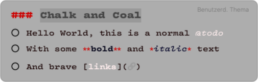
## Colorful Grey Heart
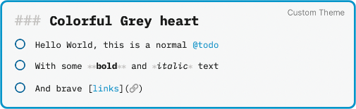
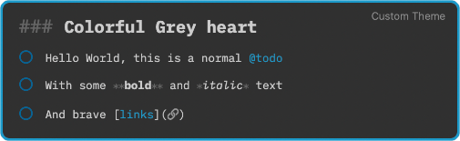
### Day One

### Dark Purple
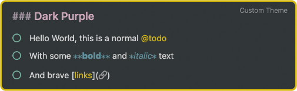
### Fang
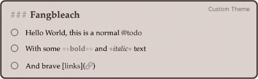
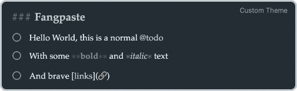
### Freestraction Simplified

### Gryffindor
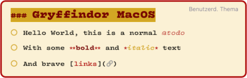
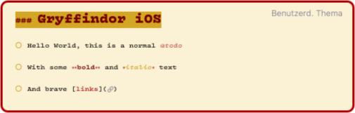
### Heart
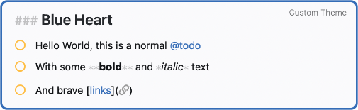
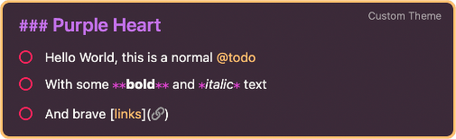
### Light/Dark NP

### Nord
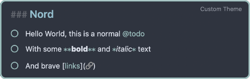
### Panda

### rB One
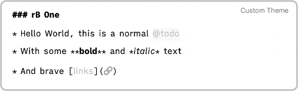
### Scripture
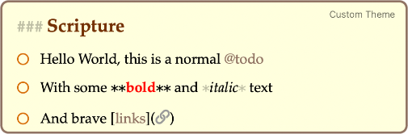
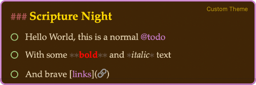  
[How to configure Scripture](https://github.com/robgrace/NPTheme-Scripture#basic-use)  
### Soft Blue
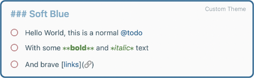
### Soft Contrast

### Squid Ink

### The Thymes
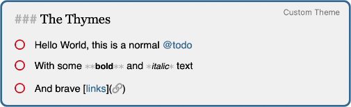
### Things

### Tomorrow Night
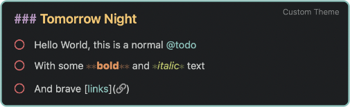
### Toothpaste Pro

### WikiWords
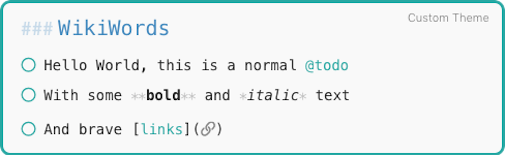
