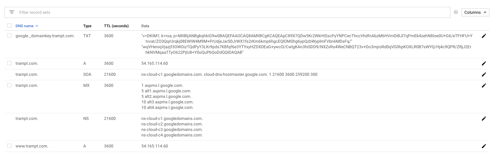

# NotePlan 3 Themes

Here's a small collection of themes (some cloned from other apps we love) for [NotePlan 3](https://noteplan.co). Please note, this currently requires NotePlan 3 v.3.0.19 or later. 

Released versions of themes are in the `bin` folder. Themes that are in work or haven't been tested are in the `src` folder. You can test your theme with the `theme test note.md` file in the root of this repo. Copy the contents of this file to a new note in NotePlan to see the available styling options. Please note, some theme options require custom regex or fonts to implement fully. 

## Installing new scripts

To install a new theme, simply download the .json file, open NotePlan 3 > Preferences > Themes, and choose `Import Theme...`. Custom themes are listed below the default built-in themes. 

### Customizing themes
You can add additional highlighting, functionality, and customize other theme components with regex. More information about supported NotePlan 3 styles and detailed documentation can be found [here](http://noteplan.co/createcustomthemes).

### Install missing fonts
- [Squid Ink](https://developer.amazon.com/en-US/alexa/branding/echo-guidelines/identity-guidelines/typography)
- [Soft_contrast iA font](https://github.com/iaolo/iA-Fonts), [Soft_contrast Input font](https://input.djr.com/download/)

## Contributing

Made something beautiful? Think of a way to improve an existing theme? Feel free to open a pull request or a new issue on GitHub!

## Available Themes
### Atom

### Day One

### Freestraction Simplified

### Light/Dark NP

### Panda

### Soft Contrast

### Squid Ink

### Things

### Toothpaste Pro

